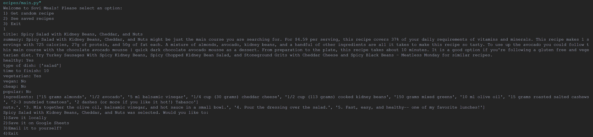

# Food Recipe API
Created a program where I can select a random recipe from the Spoonacular API (Food API) and have it sent to me via email, save it locally, or save it on Google Sheets using Sheety REST API. With each recipe, I can list the instructions, ingredients, etc. There are various facts that will be saved for each recipe. 

This was a personal project I did in which I was introduced to various APIs from a mentor and decided to combine all of them. 

### Note
 - must have credentials to run code

**Todo**
- show estimate price of recipes
- add functionality of getting instructional video for recipe
- change save format of ingredients and instructions for Sheety API
